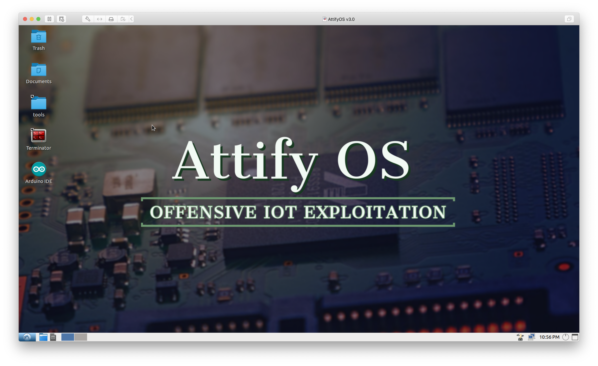
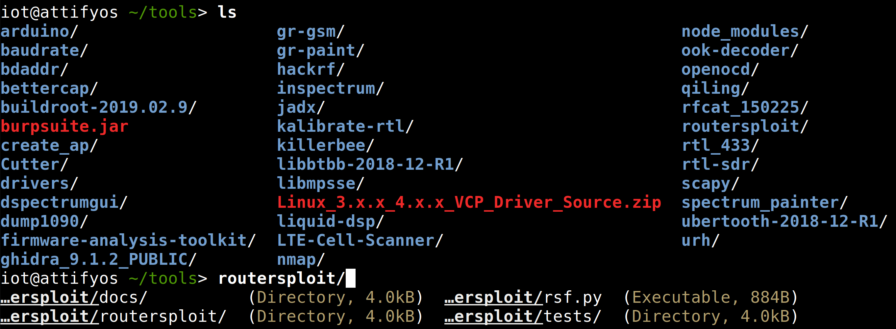
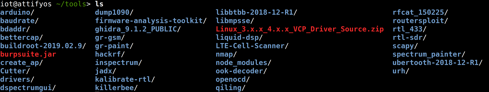
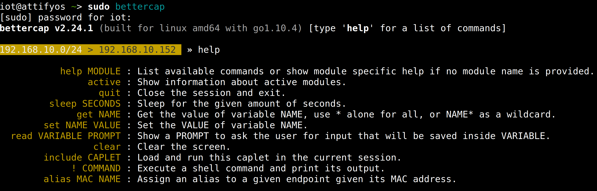
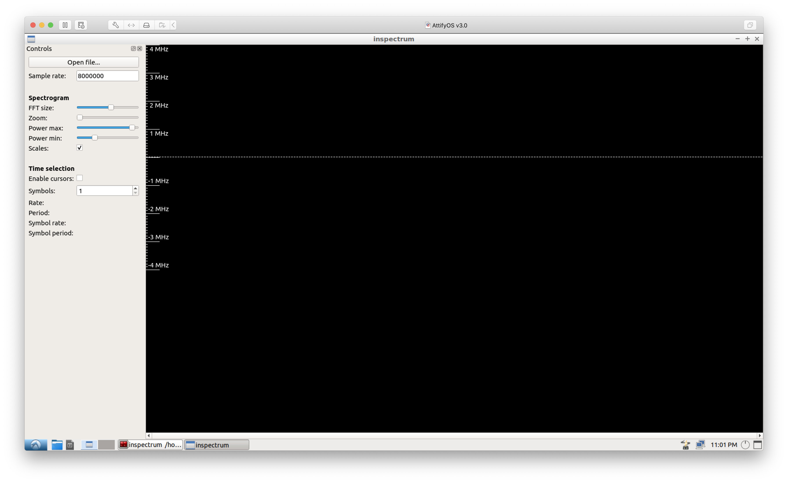

# AttifyOS v3.0

AttifyOS is a distro intended to help you perform security assessment and penetration testing of Internet of Things (IoT) devices. It saves you a lot of time by providing a pre-configured environment with all the necessary tools loaded. The new version is based on Ubuntu 18.04 64-Bit - that also means that you'll receive updates for this version till April 2023.

**Disclaimer** - Make sure you only tests the target for which you have proper authorization of. You hold all responsibilities of what you decide to do with it. 

### Download Links 

Google Drive - [https://drive.google.com/drive/folders/1C5BKrpoCtxqZODbF0A-tt0UNjx-UmKt3](https://drive.google.com/drive/folders/1C5BKrpoCtxqZODbF0A-tt0UNjx-UmKt3 "https://drive.google.com/drive/folders/1C5BKrpoCtxqZODbF0A-tt0UNjx-UmKt3")

### Tools Included 

- Arduino
- Baudrate
- BDAddr
- BetterCap
- Binwalk
- Create_AP
- Cutter
- DspectrumGUI
- Dump1090
- Firmadyne
- Firmware Analysis Toolkit
- Firmware Analysis Toolkit (FAT)
- Firmware-Mod-Kit (FMK)
- GHIDRA
- GNURadio
- GQRX
- GR-GSM
- GR-Paint
- HackRF Tools
- HackRF tools
- Inspectrum
- JADx
- Kalibrate-RTL
- KillerBee
- LibMPSSE
- Liquid-DSP
- LTE-Cell-Scanner
- NMAP
- OOK-Decoder
- Qiling
- radare2
- RFCat
- RouterSploit
- RTL-433
- RTL-SDR tools
- Scapy
- Spectrum Painter
- Ubertooth tools-
- URH (Universal Radio Hacker)

### Credentials 

`iot` : `attify` 

### How does it look like 

### Credits 

Aditya Gupta ([@adi1391](https://twitter.com/adi1391 "@adi1391")) and Barun Basak ([@0xec_](https://twitter.com/0xec_ "@0xec_")) of [Attify Team](https://attify-store.com)
